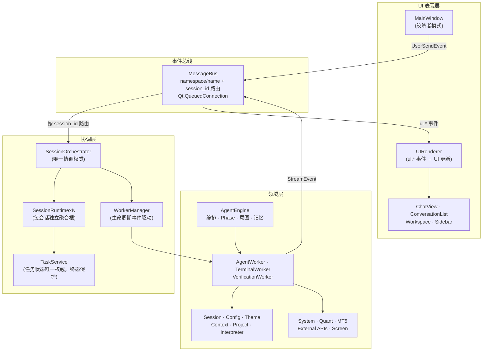
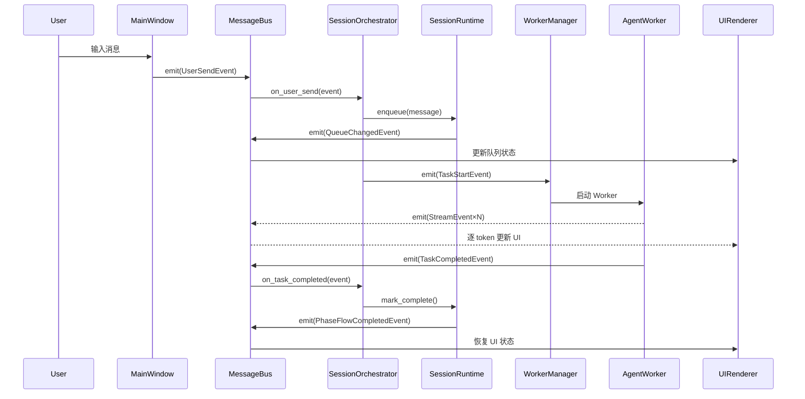

# 架构概览

> 当前架构版本：**v3.11.0**（事件总线 + 会话运行时 + 统一协调器）
> 技术栈：Python 3.11+ / PySide6 6.21 / DeepSeek V4 / Ollama / SQLite

---

## 组件关系图

---

## 分层模型

### UI 表现层

| 组件 | 职责 |
|------|------|
| `MainWindow` | 门面角色，仅负责 UI 构建与事件转发。绞杀者模式：旧路径 `_send_message` 仍可运行，新路径 `_send_message_v3` 通过 MessageBus 委托 |
| `UIRenderer` | 订阅 `ui.*` 命名空间事件，按 `session_id` 过滤后统一刷新 ChatView、状态栏、按钮状态 |
| `ChatView` · `ConversationList` · `Workspace` · `Sidebar` | 视图组件，通过 UIRenderer 被动更新，不直接持有业务状态 |

### 事件总线 (MessageBus)

`core/event_bus.py` + `core/events.py`

- 基于 `PySide6.Signal(object)` 的强类型事件总线
- 支持 `namespace.name` 精确订阅（如 `user.send`、`session.switch`、`queue.changed`）
- 所有事件携带 `session_id`，保证会话隔离
- 使用 `Qt.QueuedConnection`，保证跨线程安全
- **所有跨组件通信的唯一通道**，Manager 之间不互相调用

### 协调层

| 组件 | 职责 |
|------|------|
| `SessionOrchestrator` | v3 唯一协调权威。订阅全部业务事件，所有 TaskService 写操作必经此类 |
| `SessionRuntime×N` | 每会话独立聚合根。持有 PendingQueue、QueueManager、PhaseManager、PhaseCoordinator |
| `TaskService` | 任务状态唯一权威。终态保护：`completed`/`failed`/`cancelled` 后拒绝任何状态变更 |
| `WorkerManager` | Worker 生命周期事件驱动管理。通过 MessageBus 订阅启动/停止事件，不再基于实例 guard |
| `QueueManager` | 双槽位队列状态机（会话级），状态：IDLE / STREAMING / QUEUED_1 |
| `PhaseCoordinator` | Phase 信号 → MessageBus 事件桥接。`flow_finished.emit()` 在 `reset()` 之后执行，错误路径仅发一次系统消息 |

### 领域层

| 组件 | 职责 |
|------|------|
| `AgentEngine` | 编排器、Phase 管理、意图分类、记忆管理 |
| `AgentWorker` | 流式 LLM 推理 worker（DeepSeek / Ollama），逐 token 回调 |
| `TerminalWorker` | 终端命令执行与输出捕获 |
| `VerificationWorker` | 任务结果验证 |
| `Services` | Session、Config、Theme、Context、Project、Interpreter 等基础设施服务 |
| `Tools` | System（文件/命令）、Quant（数据分析）、MT5（量化交易）、External APIs、Screen |

---

## 核心概念

### MessageBus（事件总线）

**是什么**：基于 Qt Signal 的强类型事件总线，所有跨组件通信的唯一通道。

**为什么**：替代 Manager 之间的直接信号连接，支持按 `namespace.name` + `session_id` 精确路由，天然保证会话隔离和线程安全。

**怎么用**：`MessageBus.emit(event)` 发布，`MessageBus.subscribe(namespace, name, handler)` 订阅。

### SessionRuntime（会话运行时聚合根）

**是什么**：每个会话的完整运行时状态容器，包含 PendingQueue、QueueManager、PhaseManager、PhaseCoordinator。

**为什么**：替换全局单例队列与 Worker 池，确保切换会话时不污染其他会话的状态。

**怎么用**：`SessionOrchestrator._runtimes[session_id] = SessionRuntime(session)`，通过 `get_runtime(session_id)` 获取。

### SessionOrchestrator（统一协调器）

**是什么**：v3 核心调度器，订阅 MessageBus 上的全部业务事件，是唯一有权调用 `TaskService` 写方法的入口。

**为什么**：消除 MainWindow 直接操作 TaskService/Worker 的混乱职责，保证状态机闭环。

**怎么用**：`SessionOrchestrator._on_user_send(event)` → 入队 → 启动 Worker → 等待完成 → 标记终态。

### PendingQueue（双槽位等待队列）

**是什么**：会话级的双槽位队列（当前任务 + 排队任务），当已有一个流式任务在运行时，新任务进入槽位 1 等待。

**为什么**：替代全局单例队列，解决会话切换时队列被清空的问题。

### PhaseCoordinator（阶段协调器）

**是什么**：Phase 流程的协调器，负责 Analyze → Confirm → Execute → Verify → Archive 的流转控制。

**为什么**：将 Phase 状态管理与 UI 渲染解耦，通过 MessageBus 事件与其他 Manager 通信。

---

## 数据流

一次 Ask 模式请求的完整事件序列：

---

## 关键设计决策

| # | 决策 | 排除方案 | 原因 | 状态 |
|---|------|----------|------|------|
| 1 | 引入 MessageBus 作为唯一跨组件通信层 | 继续使用 Qt Signal 直连 | 难以按 session_id 路由，跨线程边界模糊 | ✅ 已执行 |
| 2 | 每会话独立 SessionRuntime 聚合根 | 全局单例队列与 Worker 池 | 会话切换互相污染，状态覆盖 | ✅ 已执行 |
| 3 | SessionOrchestrator 作为唯一协调权威 | MainWindow 直接操作 TaskService/Worker | 职责混乱，状态覆盖 | ✅ 已执行 |
| 4 | TaskService 增加终态保护 | 任务完成后仍允许覆盖状态 | UI 红色不转绿，状态不一致 | ✅ 已执行 |
| 5 | PhaseCoordinator flow_finished 在 reset() 后执行 | emit 在 reset 之前 | PHASE_BUSY 重入错误 | ✅ 已执行 |
| 6 | MainWindow 绞杀者模式（新旧路径并存） | 一次性全量替换 | 风险过高，缺乏回退路径 | ✅ 已执行 |

---

## 扩展点

### 新增工具
在 `tools/` 下新增模块，在 `TOOL_DEFINITIONS` 中注册工具元数据，在 `TOOL_MAP` 中绑定实现函数。

### 新增 LLM 提供商
在 `config/config.yaml` 的 `llm_providers` 下新增条目（provider_id、name、api_base、model_id）。

### 新增会话状态字段
在 `SessionRuntime` 添加新字段，在 `SessionOrchestrator` 注册对应事件订阅。注意终态保护逻辑。

### UI 定制
在 `resources/themes/` 下新增 QSS 主题文件，通过 ThemeService 加载。
